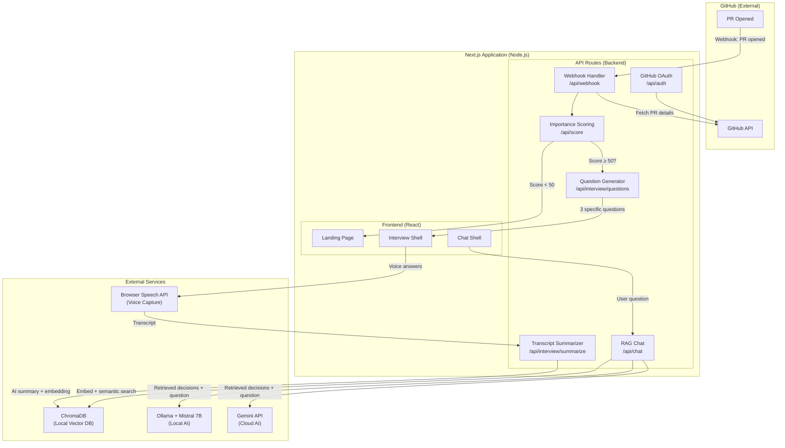
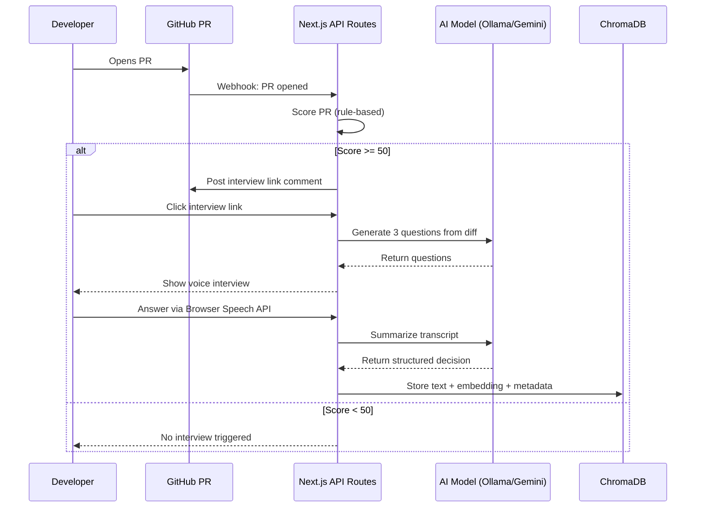
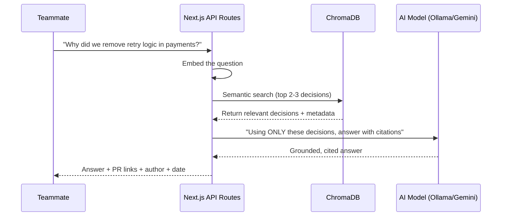
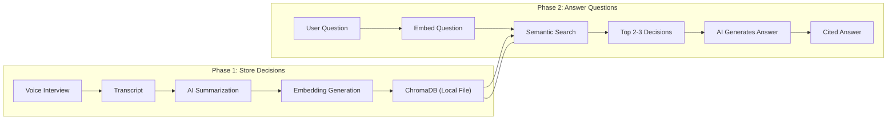
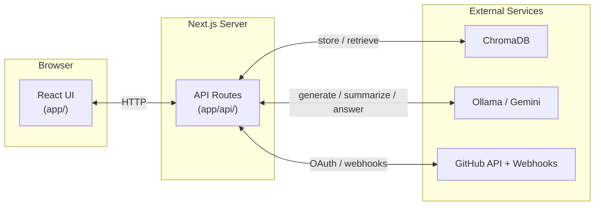

# Codence — Your Codebase's Institutional Memory

> *"GitHub remembers what changed. Codence remembers why."*

---

## Table of Contents

1. [The Problem](#1-the-problem)
2. [The Solution — Codence](#2-the-solution--Codence)
3. [Key Features](#3-key-features)
4. [How the AI Actually Works — RAG Explained](#4-how-the-ai-actually-works--rag-explained)
5. [ChromaDB — The Local Knowledge Store](#5-chromadb--the-local-knowledge-store)
6. [Local AI vs Cloud AI](#6-local-ai-vs-cloud-ai--how-theyre-different)
7. [Tech Stack](#7-tech-stack)
8. [How We're Different From Existing Tools](#8-how-were-different-from-existing-tools)
9. [Architecture](#9-architecture)
10. [Getting Started](#10-getting-started)
11. [What Gets Stored Per Decision](#11-what-gets-stored-per-decision)
---

## 1. The Problem

Every engineering team faces the same silent crisis:

- A senior developer leaves and takes **3 years of architectural reasoning** with them.
- A new teammate asks *"why is this code like this?"* and nobody remembers.
- Someone touches a workaround that existed for a critical reason — and **breaks production**.

PR descriptions say *what* changed. Nobody writes *why*.

> **The core gap:** Git tracks what changed. Nothing tracks why it changed — the reasoning, the alternatives considered, the risks acknowledged. That context lives only in people's heads, and it walks out the door with them.

---

## 2. The Solution — Codence

Codence captures the reasoning behind code decisions **at the moment they're made**, stores them as a searchable knowledge base, and lets anyone on the team ask questions about why the codebase is the way it is — and get **grounded, cited answers**.

### The Full Flow

| Step | What happens |
|------|-------------|
| 1. PR opened | Developer opens a PR on GitHub |
| 2. Importance score | Codence analyses the PR — files touched, lines changed, keywords — and scores it 0-100 |
| 3. Interview triggered | If score ≥ 50, a bot posts a comment on the PR with an interview link |
| 4. Voice interview | Developer clicks the link, answers 3 AI-generated questions about the decision via voice |
| 5. AI summarization | Codence transcribes the answers and summarizes them into a structured decision record |
| 6. Stored locally | The decision (text + meaning fingerprint) is saved to a local database — nothing leaves the machine |
| 7. Searchable forever | Anyone can open Codence chat and ask *"why did we do X?"* and get a grounded, cited answer |

---

## 3. Key Features

### Smart Importance Scoring

Not every PR needs an interview. Codence scores each PR using a rule-based system:

- Files touched
- Sensitivity of directories (`auth/`, `payments/`, `config/`)
- New files created
- Dependency changes
- Keywords in the PR title

Only PRs scoring **≥ 50** trigger an interview. A manual override button always lets developers initiate one regardless of score.

### AI-Generated Voice Interview

The interview questions aren't generic. Codence reads the actual PR diff and generates **3 specific questions** grounded in what changed — e.g. *"I see you changed the retry logic in payment_processor.py — what drove that decision?"*

- If the AI call fails, it silently falls back to 3 solid default questions
- The interview is async, skippable, and never blocks a merge

### RAG-Powered Chat

When a teammate asks a question, Codence doesn't guess:

1. It searches the stored decisions **by meaning** (not just keywords)
2. Retrieves the top 2-3 most relevant ones
3. Hands them to the AI to generate a **grounded answer**
4. Every answer **cites its source PR, author, and date**
5. If nothing relevant is stored, it says so honestly instead of hallucinating

### Fully Local, Fully Private

Codence runs entirely on your machine:

- **AI model:** Mistral 7B via Ollama (runs locally)
- **Decision database:** ChromaDB (local folder)
- **Nothing is sent to any external server**

Your code, your decisions, your data — all stay on your machine.

### Cloud API Option

For teams that prefer convenience over privacy:

- Supports cloud API mode (Gemini/OpenAI)
- User brings their own API key
- Setup takes 2 minutes
- Codence asks on first launch which mode you prefer — switch anytime

---

## 4. How the AI Actually Works — RAG Explained

Codence uses **RAG — Retrieval Augmented Generation**.

### The Open-Book Exam Analogy

> Imagine an AI model is taking an exam. Without RAG, it answers purely from memory — whatever it learned during training. It has no idea what happened inside your specific team.
>
> With RAG, before answering, the AI first searches your stored decisions, finds the relevant ones, reads them, and then answers based on what's actually there.
>
> It's the difference between guessing and actually knowing.

### Phase 1 — Storing Decisions (After Each Voice Interview)

1. Developer answers voice interview questions
2. AI summarizes the transcript into a structured decision record
3. The summary gets converted into an **embedding** — a list of numbers representing its meaning
4. ChromaDB stores both the text AND the embedding locally
5. Repeat for every important PR going forward

### Phase 2 — Answering Questions (When Someone Uses the Chat)

1. Teammate types: *"why did we remove the retry logic in payments?"*
2. That question also gets converted into an embedding (a meaning fingerprint)
3. ChromaDB compares it against ALL stored embeddings and finds the closest matches — even if the exact words don't match
4. Top 2-3 relevant decisions are retrieved
5. Those decisions + the question are sent to Mistral (locally): *"Using ONLY these stored decisions, answer the question and cite each source"*
6. Mistral reads them and responds with a grounded, cited answer

> **Why this matters:** The AI never makes things up. It only uses what your team actually recorded. Every answer comes with a PR link, author name, and date — so anyone can verify it instantly.

---

## 5. ChromaDB — The Local Knowledge Store

ChromaDB is the database that powers Codence's search. Unlike a normal database that only finds exact matches, ChromaDB searches **by meaning** — so *"why did we change the login system"* finds a decision that says *"switched auth library due to CVE,"* even though they share zero words.

- Installed with one command
- Runs as a local folder on the machine
- Requires no account, no server, and no internet

### What's Stored

| Field | Example |
|-------|---------|
| The actual text | "Removed retry logic because it caused duplicate charges under high load" |
| The embedding (meaning fingerprint) | `[0.23, -0.87, 0.45 ... ]` — 1500 numbers, never read directly |
| The metadata | PR #47 · Aryan · March 12 2025 · payment_processor.py |

---

## 6. Local AI vs Cloud AI — How They're Different

| | Local AI (Ollama + Mistral) | Cloud AI (Gemini/OpenAI) |
|---|---|---|
| **API Key needed?** | No | Yes |
| **Costs money?** | Free forever | After free tier |
| **Data leaves machine?** | Never | Sent to Google/OpenAI |
| **Works without internet?** | Yes | No |
| **Setup difficulty** | Install Ollama + download model (~4GB) | Paste API key, done |
| **Best for** | Privacy-first teams, enterprises, sensitive code | Startups, quick setup, any laptop |
| **Model quality** | Very good (Mistral 7B) | Excellent (Gemini Pro) |

**Codence's approach:** On first launch, ask the user to choose. Default to Local AI for maximum privacy. Let them switch anytime.

For the hackathon demo, we run Local AI on the M5 Mac.

---

## 7. Tech Stack

| Layer | Technology | Why |
|-------|-----------|-----|
| **Frontend** | Next.js + Tailwind CSS | Fast to build, looks polished |
| **Backend** | Node.js / Express | Handles GitHub webhook + API routes |
| **AI Model (local)** | Mistral 7B via Ollama | Runs locally, no API key, private |
| **AI Model (cloud)** | Gemini API | Easy setup for development + cloud mode |
| **Vector Database** | ChromaDB | Local, no setup, built-in embeddings |
| **Voice Capture** | Browser Speech API | Zero dependencies, works in any browser |
| **GitHub Integration** | GitHub OAuth + Webhooks | Trigger on PR open, post comments |
| **Demo Machine** | Apple M5 MacBook (team) | Best local AI performance on the team |

---

## 8. How We're Different From Existing Tools

| | Codence | Swimm | Falconer |
|---|---------|-------|----------|
| **How it captures reasoning** | Voice interview at PR time | Infers from code + old docs | Mines Slack threads |
| **When it captures** | In the moment, real-time | After the fact, retroactive | After the fact |
| **In developer's own words?** | Yes | No — AI guesses | Partially |
| **Data privacy** | Fully local option | Cloud-based | Cloud-based |
| **Trigger** | PR webhook | Manual | Manual |
| **Free to run** | Yes, with Ollama | Paid product | Paid product |

> **The one-line wedge:** Swimm and Falconer guess why decisions were made, after the fact. Codence captures it in the developer's own spoken words, at the moment it happens. That's the difference between a reconstruction and a recording.

---

## 9. Architecture

### High-Level System Diagram



### Voice Interview Flow



### RAG-Powered Chat Flow



### Data Flow Diagram



### Next.js + Node.js — Why Both?

**Short answer:** Next.js IS Node.js. They're not separate things.

**What's actually happening:**

- **Next.js** is a React framework that runs on Node.js
- **Next.js API Routes** (in `app/api/` or `pages/api/`) ARE your backend — they're Node.js functions
- You don't need a separate Express server for the MVP
- Later, if you need webhooks that run independently, you can add a lightweight Express server

**For this project:**



- **`app/`** — Your React pages (landing, interview, chat)
- **`app/api/`** — Your backend endpoints (handle webhooks, score PRs, generate questions, RAG chat)
- **ChromaDB** — Local vector database (separate process, called from API routes)
- **Ollama/Gemini** — AI model (separate process, called from API routes)

---

## 10. Getting Started

### Prerequisites

- Node.js 18+ (comes with npm)
- Python 3.10+ (for ChromaDB)
- Ollama (for local AI mode)
- GitHub account (for OAuth setup)

### Installation

```bash
# 1. Clone the repository
git clone https://github.com/your-team/Codence.git
cd Codence

# 2. Install frontend dependencies
npm install

# 3. Install ChromaDB
pip install chromadb

# 4. Install Ollama (for local AI)
# macOS:
brew install ollama
# Linux:
curl -fsSL https://ollama.com/install.sh | sh

# 5. Download Mistral 7B model
ollama pull mistral

# 6. Set up environment variables
cp .env.example .env
# Edit .env with your configuration

# 7. Run the development server
npm run dev
```

### Environment Variables

```env
# GitHub OAuth
GITHUB_CLIENT_ID=your_client_id
GITHUB_CLIENT_SECRET=your_client_secret

# AI Mode (local or cloud)
AI_MODE=local

# Cloud AI (if using cloud mode)
GEMINI_API_KEY=your_gemini_key
OPENAI_API_KEY=your_openai_key

# ChromaDB
CHROMA_DIR=./chroma_data
```

### Development Server

```bash
npm run dev
# Open http://localhost:3000
```

---

## 11. What Gets Stored Per Decision

Every captured decision saves these fields in ChromaDB:

| Field | What it contains |
|-------|------------------|
| `pr_url` | Direct link to the GitHub PR — cited in every chat answer |
| `pr_title` | Title of the PR |
| `repo` | Which repository this decision belongs to |
| `files_changed` | Which files were touched in the PR |
| `author` | Who made the decision |
| `timestamp` | When the decision was captured |
| `importance_score` | The PR's importance score |
| `trigger_reason` | Why Codence flagged this PR |
| `interview_questions` | The 3 questions the AI generated |
| `raw_transcript` | The developer's exact spoken words |
| `ai_summary` | Condensed, structured version of the decision |
| `embedding_vector` | Single vector on the summary, powers semantic search |
| `tags` | Auto-extracted keywords for filtering (optional) |

---

## License

This project is licensed under the MIT License — see the [LICENSE](LICENSE) file for details.

